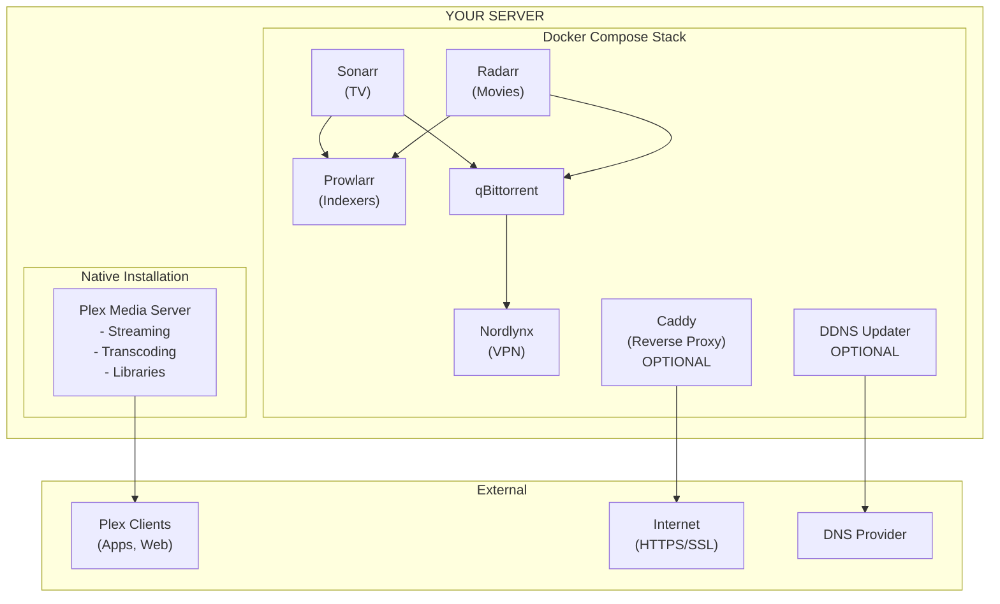
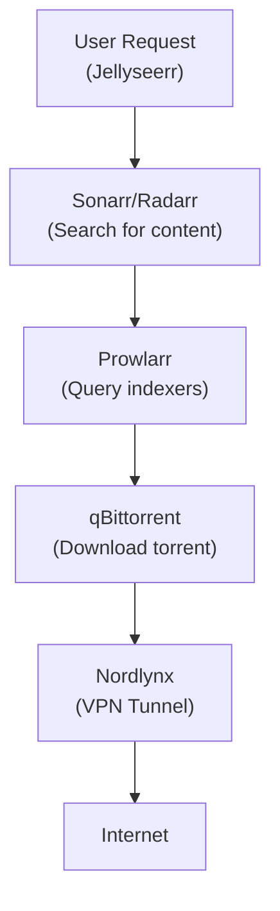
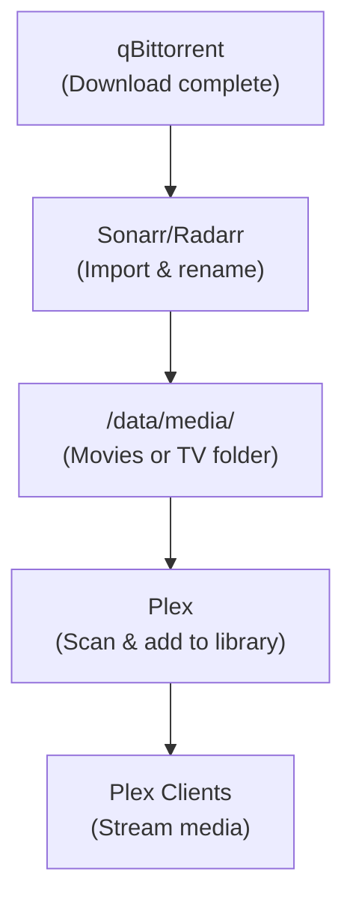
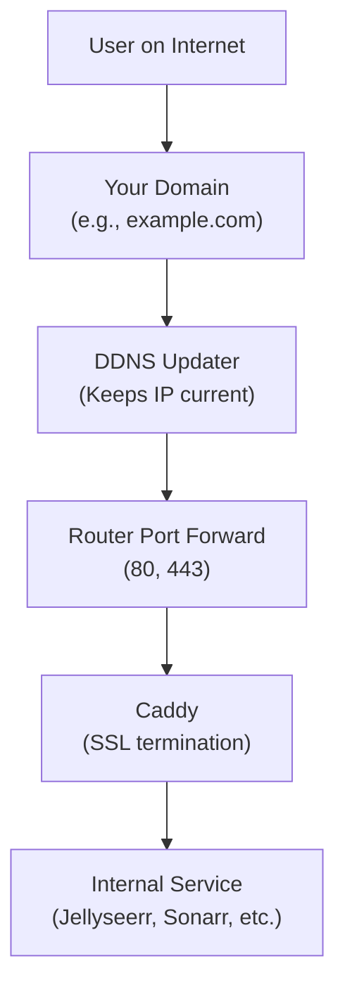
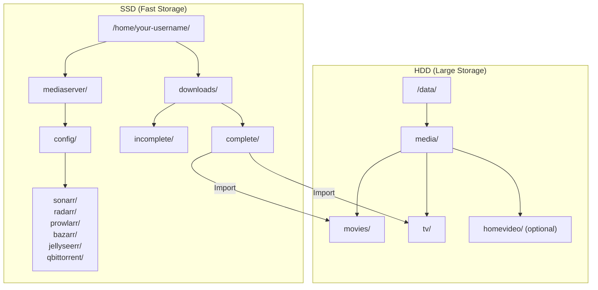

# System Architecture

This document explains how all the components of the home media server work together.

## Overview

The system is designed around a few key principles:

1. **Separation of concerns** - Each service has a single responsibility
2. **Container isolation** - Most services run in Docker for easy management
3. **VPN protection** - All torrent traffic is isolated behind a VPN
4. **Secure remote access** - HTTPS with automatic certificate renewal

## Component Diagram

## Data Flow

### 1. Content Request Flow

### 2. Media Import Flow

### 3. Remote Access Flow (Optional - with Domain)

> **Note:** This flow is optional. For Plex-only remote access, Plex handles connectivity directly through port 32400 without needing a domain or Caddy.

## Service Responsibilities

### Plex Media Server (Native)

**Why native instead of Docker?**
- Direct access to Intel Quick Sync Video (QSV) for hardware transcoding
- No container overhead for high-bandwidth streaming
- Simpler GPU device passthrough
- Plex's built-in update mechanism works seamlessly

**Responsibilities:**
- Media library management
- Video transcoding (real-time and offline)
- User authentication
- Remote streaming via Plex's relay or direct connection

### Sonarr (Docker)

**Purpose:** TV show automation

**Responsibilities:**
- Track TV shows you want
- Monitor indexers for new episodes
- Send download requests to qBittorrent
- Import and rename completed downloads
- Manage quality profiles and upgrades

### Radarr (Docker)

**Purpose:** Movie automation

**Responsibilities:**
- Track movies you want
- Monitor indexers for releases
- Send download requests to qBittorrent
- Import and rename completed downloads
- Manage quality profiles and upgrades

### Prowlarr (Docker)

**Purpose:** Centralized indexer management

**Responsibilities:**
- Store indexer configurations in one place
- Sync indexers to Sonarr and Radarr automatically
- Handle indexer authentication and rate limiting
- Provide unified search interface

### qBittorrent (Docker)

**Purpose:** Torrent download client

**Responsibilities:**
- Receive download requests from Sonarr/Radarr
- Manage torrent downloads
- Organize downloads into categories
- Notify Sonarr/Radarr when downloads complete

**Network isolation:** Shares network namespace with nordlynx container, so all traffic goes through VPN.

### Nordlynx (Docker)

**Purpose:** VPN client (NordVPN WireGuard)

**Responsibilities:**
- Establish WireGuard VPN tunnel to NordVPN
- Route all qBittorrent traffic through VPN
- Protect your IP address during downloads

**Security:** Combined with the optional host-level kill-switch, this ensures no traffic leaks if the VPN disconnects.

### Caddy (Docker) - Optional

**Purpose:** Reverse proxy with automatic SSL

> **Note:** Caddy is optional. It provides pretty URLs (`https://media.example.com`) and HTTPS for services other than Plex. Plex has its own remote access that works without Caddy.

**Responsibilities:**
- Terminate HTTPS connections
- Route requests to appropriate internal services
- Automatically obtain and renew Let's Encrypt certificates
- Handle HTTP to HTTPS redirects

### DDNS Updater (Docker) - Optional

**Purpose:** Keep DNS records updated

> **Note:** Only needed if you're using a domain name with a dynamic home IP address.

**Responsibilities:**
- Monitor your public IP address
- Update DNS records when IP changes
- Support for multiple DNS providers (Porkbun, Cloudflare, etc.)

### Bazarr (Docker) - Optional

**Purpose:** Automatic subtitle downloads

**Responsibilities:**
- Monitor your Sonarr/Radarr libraries
- Search subtitle providers for matching subtitles
- Download and rename subtitles to match media files

### Jellyseerr (Docker) - Optional

**Purpose:** Request management interface

**Responsibilities:**
- Provide user-friendly interface for requesting content
- Integrate with Plex for authentication
- Send requests to Sonarr/Radarr
- Track request status and notify users

## Network Architecture

### Port Assignments

| Port | Service | Exposure |
|------|---------|----------|
| 32400 | Plex | LAN + WAN (direct) |
| 80 | Caddy (HTTP) | WAN (redirect to 443) |
| 443 | Caddy (HTTPS) | WAN |
| 8989 | Sonarr | LAN only |
| 7878 | Radarr | LAN only |
| 9696 | Prowlarr | LAN only |
| 6767 | Bazarr | LAN only |
| 5055 | Jellyseerr | LAN only (proxied via Caddy) |
| 8080 | qBittorrent | localhost only |

### Docker Networks

The Docker Compose stack creates a default bridge network (`mediaserver_default`) that allows containers to communicate using service names as hostnames.

**Special case - qBittorrent:** Uses `network_mode: service:nordlynx` to share the nordlynx container's network namespace. This ensures all qBittorrent traffic goes through the VPN tunnel.

## Storage Architecture

### Recommended Layout

### Why This Layout?

1. **SSD for downloads:** Torrent clients perform lots of random I/O. SSDs handle this much better than HDDs.

2. **SSD for configs:** Service databases benefit from fast storage, especially during searches and imports.

3. **HDD for media:** Media files are large and accessed sequentially. HDDs provide cost-effective bulk storage.

4. **Separate download and media paths:** Sonarr/Radarr move completed files from downloads to media, keeping things organized.

## Security Layers

### 1. SSH Security
- Key-only authentication (no passwords)
- fail2ban for brute-force protection
- Specific user whitelist

### 2. VPN Protection
- All torrent traffic through NordVPN
- WireGuard protocol for speed and security
- Optional host-level kill-switch

### 3. HTTPS Everywhere
- Caddy handles automatic SSL certificates
- Let's Encrypt for trusted certificates
- Automatic certificate renewal

### 4. Service Isolation
- qBittorrent only accessible via localhost
- Internal services not exposed to internet directly
- Docker network isolation

---

**Next:** [Introduction](guide/00-introduction.md)
