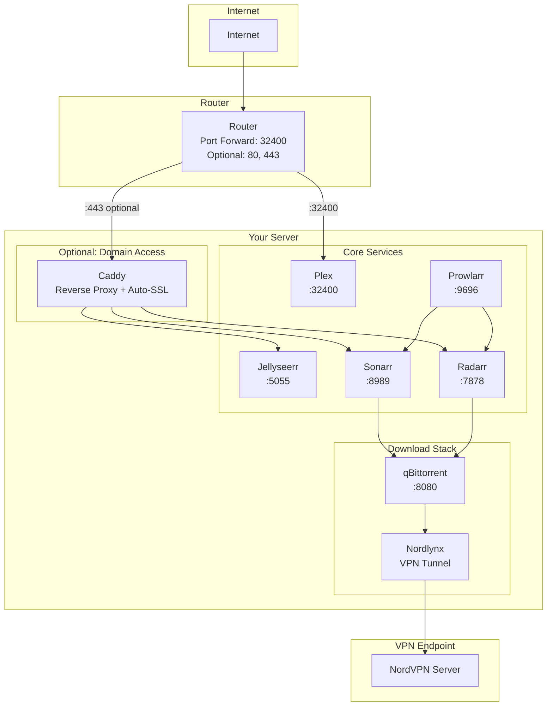
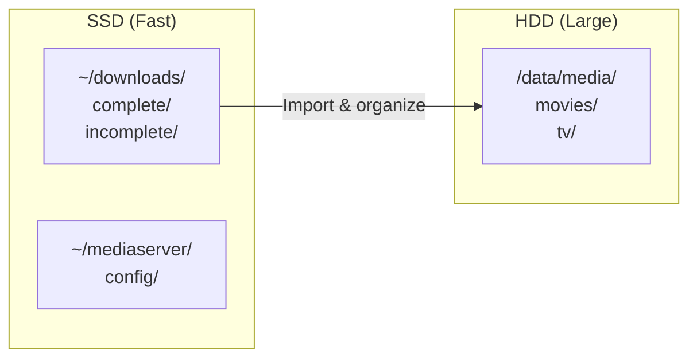

# Home Media Server Guide

> **Note:** In its current state, this guide was largely written by Claude Code but drawing from a mountain of messy notes, config files and outputs from my own server installation. I am in the process of manual review of each section - I have read everything through once and broadly it is correct, but I will update this note once full verification has been completed.

A comprehensive, beginner-friendly guide for building a home media server with automated content management, secure remote access, and VPN-protected downloads.

## What You'll Build

This guide walks you through setting up a complete home media server with:

- **Plex Media Server** - Stream your media library to any device
- **Sonarr & Radarr** - Automatically download and organize TV shows and movies
- **Prowlarr** - Centralized indexer management
- **qBittorrent + NordVPN** - VPN-protected torrent downloads
- **Caddy** - Secure HTTPS reverse proxy with automatic SSL certificates
- **Jellyseerr** - Let friends and family request content (optional)
- **Bazarr** - Automatic subtitle downloads (optional)

## Architecture Overview

### Storage Layout

## Prerequisites

Before starting, you'll need:

- **Hardware**: A dedicated computer (Intel CPU recommended for hardware transcoding)
- **The latest Ubuntu Server LTS**: Fresh installation
- **NordVPN subscription**: For VPN-protected downloads
- **Basic Linux knowledge**: Comfortable with terminal commands

**Optional:** A domain name if you want pretty URLs like `https://media.example.com` instead of accessing services by IP address. See [Part 3](#part-3-remote-access-optional) for details.

See [Hardware and Planning](guide/01-hardware-and-planning.md) for detailed requirements.

## Guide Chapters

### Part 1: Foundation

| # | Chapter | Description |
|---|---------|-------------|
| 0 | [Introduction](guide/00-introduction.md) | What you're building and skill requirements |
| 1 | [Hardware and Planning](guide/01-hardware-and-planning.md) | Hardware requirements and planning checklist |
| 2 | [Install Ubuntu](guide/02-install-ubuntu.md) | Ubuntu Server LTS installation |
| 3 | [Install Docker](guide/03-install-docker.md) | Docker Engine from official repository |
| 4 | [SSH Security](guide/04-ssh-security.md) | Secure remote access with fail2ban |
| 5 | [Storage Setup](guide/05-storage-setup.md) | Media and download directory structure |

### Part 2: Core Services

| # | Chapter | Description |
|---|---------|-------------|
| 6 | [Install Plex](guide/06-install-plex.md) | Plex Media Server with hardware transcoding |
| 7 | [Docker Compose Stack](guide/07-docker-compose-stack.md) | Deploy all containerized services |
| 8 | [Configure qBittorrent](guide/08-configure-qbittorrent.md) | Torrent client setup behind VPN |
| 9 | [Configure Prowlarr](guide/09-configure-prowlarr.md) | Indexer management |
| 10 | [Configure Sonarr](guide/10-configure-sonarr.md) | TV show automation |
| 11 | [Configure Radarr](guide/11-configure-radarr.md) | Movie automation |
| 12 | [Configure Bazarr](guide/12-configure-bazarr.md) | Automatic subtitles *(optional)* |
| 13 | [Configure Jellyseerr](guide/13-configure-jellyseerr.md) | Request management *(optional)* |

### Part 3: Remote Access (Optional)

> **Note:** Chapters 14-17 are **optional**. Plex has built-in remote access that works without a domain name or reverse proxy. These chapters are for users who want pretty URLs (`https://media.example.com`) instead of IP addresses, or who want to expose other services (Jellyseerr, Sonarr, Radarr) externally with HTTPS.

| # | Chapter | Description |
|---|---------|-------------|
| 14 | [Domain and DNS](guide/14-domain-and-dns.md) | Purchase domain and configure DNS *(optional)* |
| 15 | [Router Configuration](guide/15-router-configuration.md) | Port forwarding and static IP |
| 16 | [Caddy Reverse Proxy](guide/16-caddy-reverse-proxy.md) | HTTPS with automatic SSL *(optional)* |
| 17 | [DDNS Updater](guide/17-ddns-updater.md) | Keep DNS updated with dynamic IP *(optional)* |
| 18 | [Plex Remote Access](guide/18-plex-remote-access.md) | Enable streaming from anywhere |

### Part 4: Security and Extras

| # | Chapter | Description |
|---|---------|-------------|
| 19 | [VPN Kill-Switch](guide/19-vpn-killswitch.md) | Host-level VPN enforcement *(optional)* |
| 20 | [get-iplayer](guide/20-get-iplayer.md) | BBC iPlayer downloads *(optional)* |
| 21 | [Verification Checklist](guide/21-verification-checklist.md) | Complete system verification |
| 22 | [Maintenance](guide/22-maintenance.md) | Updates, backups, and troubleshooting |

## Appendices

| Appendix | Description |
|----------|-------------|
| [A: NordVPN WireGuard Key](appendices/A-nordvpn-wireguard-key.md) | How to get your WireGuard private key |
| [B: Indexer Guide](appendices/B-indexer-tracker-guide.md) | Understanding indexers and trackers |
| [C: Troubleshooting](appendices/C-troubleshooting.md) | Common problems and solutions |
| [D: Service Ports](appendices/D-service-ports-reference.md) | Port reference table |
| [E: File Paths](appendices/E-file-paths-reference.md) | Directory structure reference |

## Quick Reference

### Service URLs (Local Network)

| Service | URL | Purpose |
|---------|-----|---------|
| Plex | `http://server-ip:32400/web` | Media streaming |
| Sonarr | `http://server-ip:8989` | TV automation |
| Radarr | `http://server-ip:7878` | Movie automation |
| Prowlarr | `http://server-ip:9696` | Indexer management |
| Bazarr | `http://server-ip:6767` | Subtitles |
| Jellyseerr | `http://server-ip:5055` | Requests |
| qBittorrent | `http://localhost:8080` | Downloads (localhost only) |

### Key Directories

| Path | Purpose |
|------|---------|
| `/data/media/movies` | Movie library |
| `/data/media/tv` | TV show library |
| `~/downloads/complete` | Finished downloads |
| `~/downloads/incomplete` | In-progress downloads |
| `~/mediaserver/config` | Service configurations |

## Configuration Files

Ready-to-use configuration templates are in the [`configs/`](configs/) directory:

- [`docker-compose.yml`](configs/docker-compose.yml) - Full service stack
- [`example.env`](configs/example.env) - Environment variables template
- [`Caddyfile.example`](configs/Caddyfile.example) - Reverse proxy configuration
- [`ddns-config.json.example`](configs/ddns-config.json.example) - DDNS updater configuration

## Getting Help

- Check the [Troubleshooting Appendix](appendices/C-troubleshooting.md) for common issues
- Each service has extensive documentation on their official websites
- The [r/selfhosted](https://reddit.com/r/selfhosted) community is helpful for general questions

## Original Documentation

The [`documentation/`](documentation/) directory contains the original rebuild documentation for restoring from backups. The [`PLAN.md`](PLAN.md) file documents the architectural decisions made during the original server rebuild.

---

**Ready to start?** Begin with [Chapter 0: Introduction](guide/00-introduction.md)
