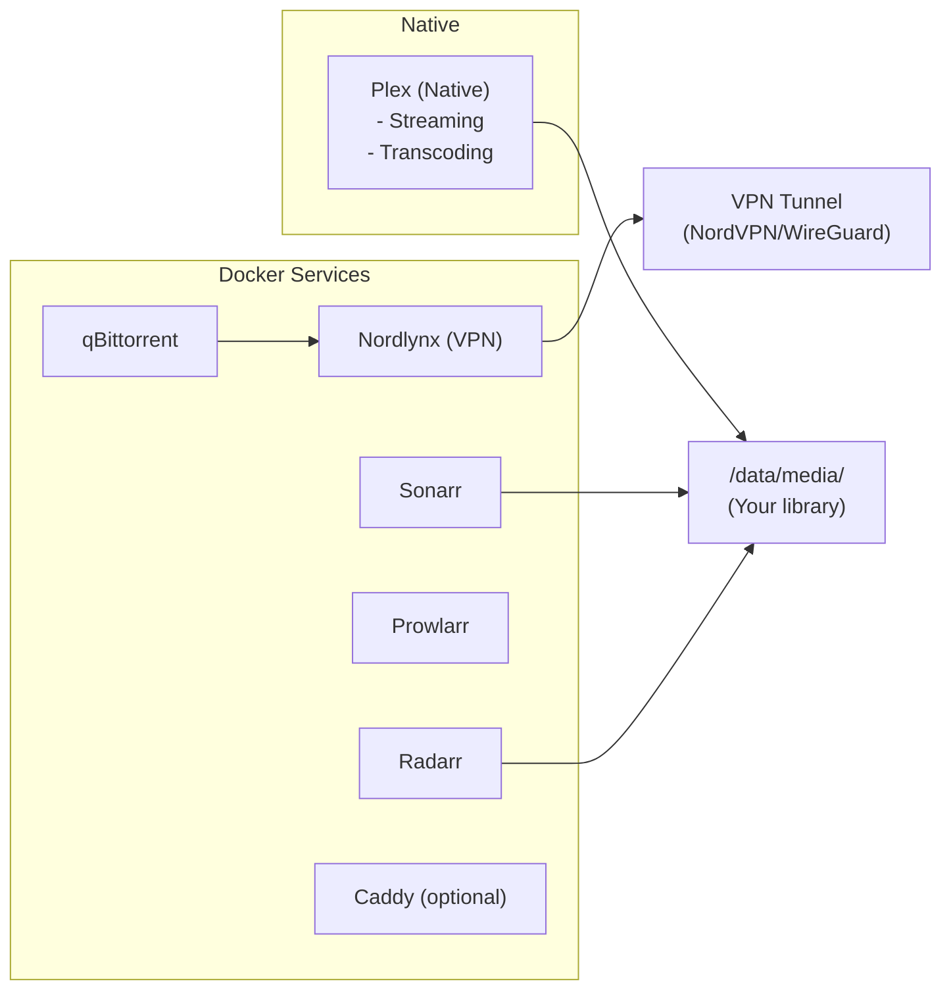

# Chapter 0: Introduction

Welcome to the Home Media Server Guide. This guide will walk you through building a complete media server system from scratch.

## What You'll Build

By the end of this guide, you'll have a server that can:

- **Stream your media library** to any device, anywhere in the world
- **Automatically download** TV shows and movies based on your preferences
- **Organize and rename** your media files consistently
- **Provide subtitles** automatically for your content
- **Let friends and family request** movies and shows through a simple interface
- **Protect your privacy** by routing downloads through a VPN

## How Long Will This Take?

Plan for **4-8 hours** for the complete setup, depending on your experience level:

| Phase | Chapters | Time Estimate |
|-------|----------|---------------|
| Foundation | 1-5 | 1-2 hours |
| Core Services | 6-13 | 2-3 hours |
| Remote Access | 14-18 | 1-2 hours |
| Security & Extras | 19-22 | 1 hour |

You don't need to complete everything in one session. The guide is structured so you can stop at natural breakpoints.

## Skill Requirements

This guide assumes you:

- **Can use a terminal** - You'll be typing commands, not clicking through GUIs
- **Understand basic file system concepts** - Paths, directories, permissions
- **Can follow instructions carefully** - Many steps involve copying commands exactly
- **Have patience for troubleshooting** - Something will inevitably not work the first time

You don't need to be a Linux expert. Each step explains what you're doing and why.

## What You'll Need

### Hardware

A dedicated computer with:
- Intel CPU (for hardware transcoding) - see [Chapter 1](01-hardware-and-planning.md) for details
- At least 8GB RAM
- SSD for operating system and downloads (256GB minimum)
- HDD for media storage (size depends on your library)
- Wired ethernet connection (recommended)

### Accounts and Subscriptions

Before starting, set up these accounts:

| Account | Required? | Purpose |
|---------|-----------|---------|
| NordVPN | Yes | VPN protection for downloads |
| Plex | Yes | Free account for basic features, Plex Pass for hardware transcoding |
| Domain registrar (Porkbun recommended) | Optional | Pretty URLs like `https://media.example.com` (Plex works without this) |
| OpenSubtitles.org | Optional | For automatic subtitle downloads |

### Software

- **The latest Ubuntu Server LTS** - The operating system (installation covered in [Chapter 2](02-install-ubuntu.md))

## Architecture Overview

Understanding how the pieces fit together will help as you work through the guide:



**Key concept:** Most services run in Docker containers for easy management, but Plex runs natively for better hardware transcoding performance.

See [ARCHITECTURE.md](../ARCHITECTURE.md) for a detailed explanation of each component.

## A Note on Security and Legality

This guide sets up tools that can be used for both legal and illegal purposes. The automation tools (Sonarr, Radarr) and torrent client (qBittorrent) are themselves legal software.

**You are responsible for:**
- Only downloading content you have the right to access
- Understanding the copyright laws in your jurisdiction
- Respecting the terms of service of any indexers you use

The VPN configuration in this guide is designed to protect your privacy, which is a legitimate concern regardless of what you download.

## Guide Conventions

Throughout this guide, you'll see:

### Command Blocks

Commands to run in your terminal look like this:
```bash
sudo apt update
```

### Placeholders

Values you need to replace are shown in angle brackets:
```bash
ssh your-username@<server-ip>
```

Replace `<server-ip>` with your actual server IP address.

### Expected Output

When a command should produce specific output, it's shown like this:
```bash
systemctl is-active docker
```
Expected output: `active`

### Warnings

> **Warning:** Important information that could cause problems if ignored.

### Tips

> **Tip:** Helpful information that can save you time.

## Getting Help

If you get stuck:

1. Check the [Troubleshooting appendix](../appendices/C-troubleshooting.md)
2. Re-read the current step carefully
3. Search for the error message online
4. Ask in [r/selfhosted](https://reddit.com/r/selfhosted) or [r/PleX](https://reddit.com/r/PleX)

## Ready?

Let's start by planning your hardware and gathering everything you need.

---

**Next:** [Chapter 1: Hardware and Planning](01-hardware-and-planning.md)
